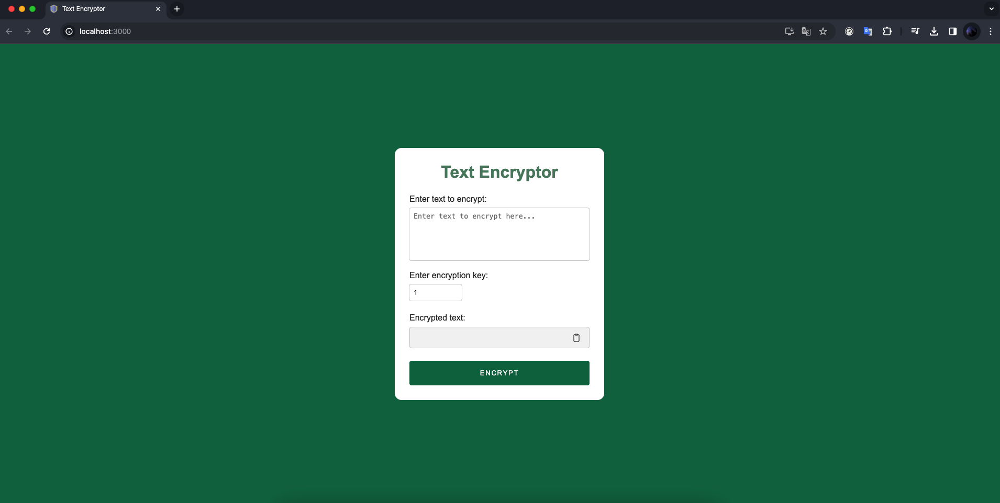

# Text Encryptor con React.js

Este proyecto es un simple text encryptor desarrollado con React.js. Permite cifrar mensajes de texto utilizando algún algoritmo de encriptación basico y con fines solo de practica.

# Captura de pantalla



## Características

- Cifrado de mensajes de texto.
- Desarrollado con React.js para una interfaz de usuario dinámica.
- Función para copiar el texto encriptado

## Instalación

1. Clona este repositorio:

    ```bash
    git clone https://github.com/ramiromtz/text-encryptor-react.git
    ```

2. Accede al directorio del proyecto:

    ```bash
    cd text-encryptor-react
    ```

3. Instala las dependencias:

    ```bash
    npm install
    ```

4. Inicia la aplicación:

    ```bash
    npm start
    ```

La aplicación estará disponible en [http://localhost:3000](http://localhost:3000) en tu navegador.

## Uso

1. Abre la aplicación en tu navegador.
2. Ingresa un mensaje de texto en el área de entrada.
3. Haz clic en el botón correspondiente para ver el resultado.

## Contribución

Si quieres contribuir a este proyecto, sigue estos pasos:

1. Haz un fork del proyecto.
2. Crea una nueva rama: `git checkout -b feature/nueva-funcionalidad`.
3. Realiza tus cambios y haz commit: `git commit -m 'Añadir nueva funcionalidad'`.
4. Haz push a la rama: `git push origin feature/nueva-funcionalidad`.
5. Abre un Pull Request.

## Contacto

- Autor: Ramiro Martínez Juárez
- Email: ramiromtz770@gmail.com
- GitHub: [ramiromtz](https://github.com/ramiromtz)
 
## Nota sobre el idioma del código

Este proyecto está escrito en inglés para seguir las mejores prácticas de la comunidad de desarrollo de software y facilitar la colaboración global. Aunque la documentación está en español para mayor accesibilidad, el código fuente utiliza convenciones en inglés.

¡Gracias por usar Text Encryptor con React.js! Si tienes alguna pregunta o problema, no dudes en contactarme.
